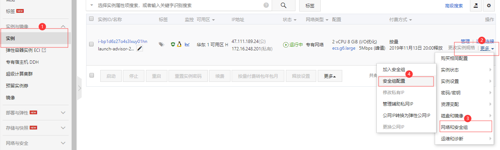
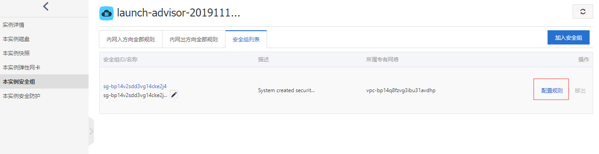
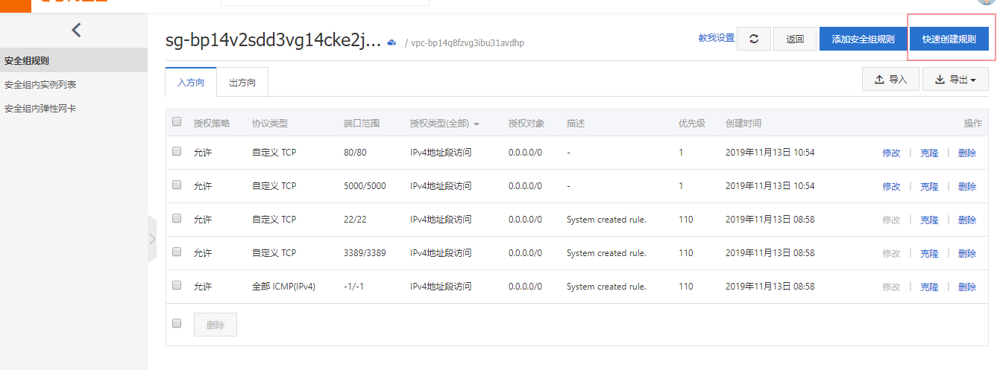
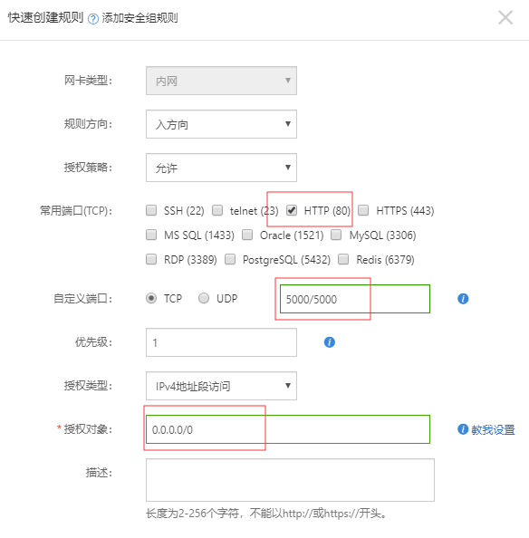
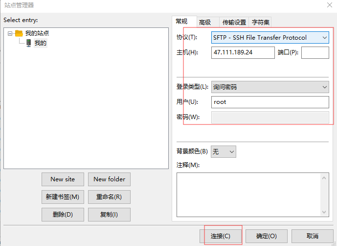
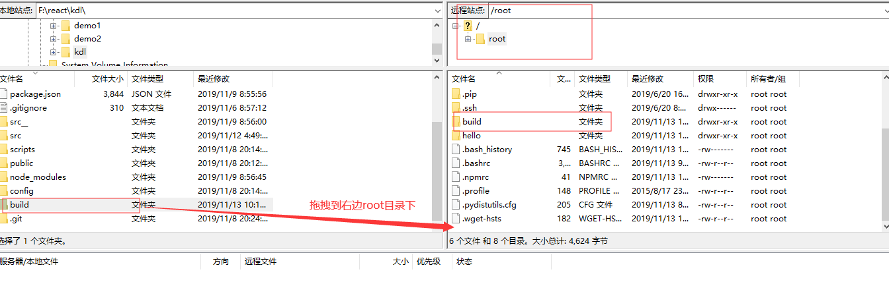

## 一、表单组件值的获取（登录页面）

在LoginPage.js中，我们使用了两个FormInput 组件，我们需要获取这两个FormInput 中input的value值(即用户输入的值)。

在React中，我们要获取组件中表单元素的值，就需要在父组件中操作子组件的数据，这些操作都需要在父组件中去完成。

因此，获取用户名，密码的这些操作，也都会在LoginPage 这个组件中来完成。

接下来开始获取：

把FormInput 做成**受控组件**：

需要给FormInput 组件**添加value和onChange**属性，

其中，value的值交给LoginPage 组件的state数据来控制，

onChange的事件函数中需要修改state数据为用户输入的值。

注意：这两个属性都是FormInput 组件的，为了让它们起作用，要传递到FormInput 的内部中的input元素里面去。

LoginPage.js组件中：

```jsx
export default class LoginPage extends Component {	
	constructor(props){
        super(props)

        this.state = {
            username:"",
            password:""
        }
        this.handleChange = this.handleChange.bind(this)
        this.handleChange2 = this.handleChange2.bind(this)
    }
    handleChange(e){
        this.setState({
            username:e.target.value
        })
    }
    handleChange2(e){
        this.setState({
            password:e.target.value
        })
    }


	...
    ...

				{/* 用户名 */}
                    <FormInput iconClass="icon-shouji" type="text" value={this.state.username} onChange={this.handleChange}/>
                    {/* 密码 */}
                    <FormInput  iconClass="icon-mima"  type="password" value={this.state.password} onChange={this.handleChange2}/>	
```

FormInput.js组件中：

```jsx
 				{/* input输入框 */}
                {/* <input type={this.props.type} value={this.props.value} onChange={this.props.onChange}/> */}
                <input  {...this.props}/>
```

这样就能做到在LoginPage中控制FormInput组件的值。

## 二、在项目中使用axios完成请求

安装axios：

```
yarn add axios
```

导入：

```js
import axios from "axios"
```

下面实现登录按钮的点击发起请求操作：

去掉点击按钮的Link标签，为他添加点击事件

FormInput.js组件中：

```jsx
<button className={"form-btn "+ has_box_class} onClick={this.props.onClick}>{this.props.children}</button>
```

LoginPage.js组件中：

```jsx
this.handleClick = this.handleClick.bind(this)

...

handleClick(e){
    e.preventDefault();
	console.log("我们将要在这里完成ajax请求。")
}

...
<FormBtn box={true} onClick={this.handleClick}>登录</FormBtn>
```


在handleClick中：

```js
	e.preventDefault();	
	let params = {
        username:this.state.uname,
        password:this.state.upwd
    }
    
	axios.get("/server/data.json",params)
        .then((resp)=>{
            if(resp.data.errno =="0"){
                // console.log(resp.data);
                Toast.success(resp.data.errmsg, 1.5);
                this.props.router.push("/home")
            }else{
                Toast.fail(resp.data.errmsg, 1.5);
                // alert(resp.data.errmsg)
            }
            
        })
        .catch((err)=>{
            console.log(err)
        })
```

如果是前后端分离项目，可以在package.json中设置代理：

```json
"proxy": "http://localhost:3003"
// 设置之后要重新启动服务器
```

## 三、首页学科导航的数据请求

server目录下准备学科数据  subject.json：

```json
[
    {
        "id":"1",
        "subjectName":"Java EE"
    },
    {
        "id":"2",
        "subjectName":"全栈UI设计"
    },
    {
        "id":"3",
        "subjectName":"H5前端"
    },
    {
        "id":"4",
        "subjectName":"Python"
    },
    {
        "id":"5",
        "subjectName":"iOS"
    },
    {
        "id":"6",
        "subjectName":"大数据"
    },
    {
        "id":"7",
        "subjectName":"C++"
    }
]
```


在Subject.js组件中：

```jsx
	constructor(props){
        super(props)

        this.state = {
            subject_data:[]
        }
    }
    componentDidMount() {
        axios.get("/server/subject.json")
        .then((resp)=>{
            console.log(resp.data)
            this.setState({
                subject_data : resp.data
            })

        })
    }
render() {
        return (
            <div className="subject">
                <Flex>
                    {
                        this.state.subject_data.map((v,k)=>{
                            if(k<4){
                                return (
                                    <Flex.Item key={k}>
                                    <a href={"#/list/"+v.id}>
                                        <i style={{backgroundPositionX:-50*v.id}}></i>
                                        <p>{v.subjectName}</p>
                                    </a>
                                </Flex.Item>
                                )
                            }
                        })
                        
                    }
                </Flex>
                <Flex>
                    {
                        this.state.subject_data.map((v,k)=>{
                            if(k>=4){
                                return (
                                    <Flex.Item key={k}>
                                    <a href={"#/list/"+v.id}>
                                        <i style={{backgroundPositionX:-50*v.id}}></i>
                                        <p>{v.subjectName}</p>
                                    </a>
                                </Flex.Item>
                                )
                            }
                        })
                        
                    }
                    <Flex.Item>
                        
                    </Flex.Item>
                </Flex>
            </div>
        )
    }
```

## 四、列表页对应路由的调整

既然在上一个步骤中我们的  list路由路径变成  #/list/id值  的格式，那么就需要在对应的路由接收参数

在App.js的路由配置中：

```jsx
<Route path="/list/:subjectId" component={ListPage} />
```

然后在ListPage.js列表页中，挂载完组件后，就可以做ajax请求对应的学科数据列表：

```js
	componentDidMount() {
        let subjectId = this.props.routeParams.subjectId
        console.log(subjectId)
        //拿到subjectId之后就拿着这个id去做列表页数据的请求
        // axios.get(`/server/list.json？subjectId=${subjectId}`)
        // .then((resp)=>{
        //     ...
        // })
    }
```

## 五、Redux介绍(了解)

Redux 是 JavaScript 状态容器，提供项目中的状态管理。 

redux的三个重要概念：

**store: 数据仓库**

**action: 组件的动作名和动作的定义**  (决定了如何修改仓库数据)

**dispatch: 执行相应的动作action**  （决定了何时修改仓库数据）

Redux中提供createStore方法用于生成一个store对象，这个函数接受一个初始值state值和一个reducer函数。当用户发出相应的action时，利用传入的reducer函数计算出一个新的state值，并返回。

使用Redux，我们只获取一次数据并将其存储在一个中心位置，称为 store。然后，任何组件都可以随时使用这些数据。这就像附近有一家超市，我们的厨师可以在那里买到所有的食材。这家超市派卡车从农场大批运回蔬菜和肉类。这比让个别厨师亲自去农场效率高得多。

store 还是唯一的数据源。组件通常从 store 中获取数据，而不是其他地方。这使得 UI 保持高度统一。

注意：

Redux 不只是为 React 而生。一个常见的误解是 Redux 仅用于 React。 听起来Redux在没有React的情况下无法做任何事情。 事实上，正如我们之前所讨论的，Redux在几个重要方面补充了React。 React 是最最常见的 Redux 用例。
然而，事实上，Redux可以使用任何前端框架，如Angular、Ember.js 甚至jQuery 或者 普通的JavaScript。

下面看一个redux代码：

（前提：先安装redux      **yarn add redux** 或者 **npm install redux**）

```jsx
/*
   redux小案例：
   
*/
import React, {Component} from 'react'
import ReactDOM from 'react-dom'

import {createStore} from 'redux'


// 请一个仓库管理员，必须是一个函数
const reducer = (state, action) => {
    console.log("执行了reducer函数")
    console.log(state, action)
    // 7、回到reducer函数，深拷贝action对象到newState，并返回
    //(此时只是reducer中的参数state发生了变化，而视图组件中的state没有改变，第8步将处理组件中的state)
    if(action.type === "up"){
        let newState = JSON.parse(JSON.stringify(state))
        newState.num1 = action.value
        return newState
    }
    // 1、定义初始state
    return {
        num1: 20
    }
}

//创建一个仓库， 把仓库管理员请来管理这个仓库
// 2、创建store仓库
const store = createStore(reducer)


export default class App extends Component {
    constructor(props){
        super(props)

        // console.log(store.getState())
        // 3、在constructor中，获取初始state
        this.state = store.getState()
        this.changeNumUp = this.changeNumUp.bind(this)

        // 8、store订阅，一旦store数据发生改变，则执行storeChange函数里面的代码
        this.storeChange = this.storeChange.bind(this)
        store.subscribe(this.storeChange)
    }

    render() {
        return (
            <div >
                {/* 4、 书写组件，填入数据 */}
                <p>{this.state.num1} </p>
                {/* 5、业务：点击让num1自增 */}
                <button onClick={this.changeNumUp}>增加</button>     
            </div>
        )
    }

    changeNumUp(e){
        // 6、改变数据的时候 需要调用store的dispatch方法，把新的值作为放在对象中传进去
        // 每次调用dispatch, 会在内部调用 图书管理员函数reducer
        const action = {
            type:'up',
            value:this.state.num1+1
        }
        store.dispatch(action)  // 每次调用dispatch, 会在内部调用 图书管理员函数reducer
    }

    storeChange(e){
        this.setState(store.getState())
    }
}


ReactDOM.render(
    <App />
    , document.getElementById('root'));
```

## 六、React-Redux

为了方便使用，Redux 的作者封装了一个 React 专用的库 React-Redux。这个库是可以选用的。实际项目中，你应该权衡一下，是直接使用 Redux，还是使用 React-Redux。后者虽然提供了便利，但是需要掌握额外的 API，并且要遵守它的组件拆分规范。

React-Redux 将所有组件分成两大类：UI 组件（presentational component）和容器组件（container component）。

#### 6.1、UI组件

UI 组件特征：

- 只负责 UI 的呈现，不带有任何业务逻辑
- 没有状态（即不使用`this.state`这个变量）
- 所有数据都由参数（`this.props`）提供
- 不使用任何 Redux 的 API

#### 6.2、容器组件

容器组件特征：

- 负责管理数据和业务逻辑，不负责 UI 的呈现
- 带有内部状态
- 使用 Redux 的 API

#### 6.3、connect()

React-Redux 提供`connect`方法，用于从 UI 组件生成容器组件。`connect`的意思，就是将这两种组件连起来。

#### 6.4、Provider组件

React-Redux 提供`Provider`组件，可以让容器组件拿到`state` 状态数据。`Provider`包裹了原来项目的根组件。


案例见进入代码中react-redux文件夹

运行案例前先安装react-redux:     **yarn add react-redux  或者 ** **npm install react-redux**

## 七、项目中使用react-redux

在App.js中：

```jsx
import {createStore} from 'redux'
import { Provider } from 'react-redux'

const defaultState = {
    subject_data: []
}

// 请一个仓库管理员，必须是一个函数
const reducer = (state = defaultState, action) => {
    if(action.type === "get_subject_data"){
        let newState = JSON.parse(JSON.stringify(state))
        newState.subject_data = action.value
        return newState
    }
    return state
}
//创建一个仓库， 把仓库管理员请来管理这个仓库
const store = createStore(reducer)


const App = (
    
    <Provider store={store}>
        <Router history={hashHistory}>
            <Route path="/" component={LoginPage} />
            <Route path="/home" component={HomePage} />
            <Route path="/list/:subjectId" component={ListPage} />
            <Route path="/detail" component={DetailPage} />
        </Router>
    </Provider>
)
ReactDOM.render(App, document.getElementById('root'));
```

Subject.js组件中

```jsx
class Subject extends Component {
    // constructor(props){
    //     super(props)

    //     this.state = {
    //         subject_data:[]
    //     }
    // }
    componentDidMount() {
        axios.get("/server/subject.json")
        .then((resp)=>{
            console.log(resp.data)
            this.props.init_sub_data(resp.data)

        })    

        
    }
    render() {
        return (
            <div className="subject">
                <Flex>
                    {
                        this.props.subject_data.map((v,k)=>{
                            if(k<4){
                                return (
                                    <Flex.Item key={k}>
                                    <a href={"#/list/"+v.id}>
                                        <i style={{backgroundPositionX:-50*v.id}}></i>
                                        <p>{v.subjectName}</p>
                                    </a>
                                </Flex.Item>
                                )
                            }
                        })
                        
                    }
                </Flex>
                <Flex>
                    {
                        this.props.subject_data.map((v,k)=>{
                            if(k>=4){
                                return (
                                    <Flex.Item key={k}>
                                    <a href={"#/list/"+v.id}>
                                        <i style={{backgroundPositionX:-50*v.id}}></i>
                                        <p>{v.subjectName}</p>
                                    </a>
                                </Flex.Item>
                                )
                            }
                        })
                        
                    }
                    <Flex.Item>
                        
                    </Flex.Item>
                </Flex>
            </div>
        )
    }
}

const mapStateToProps = (state) => {
    return {
        subject_data: state.subject_data,
    }
}


const mapDispatchToProps = (dispatch) => {

    return {
        
        init_sub_data(resp_data){
            console.log(resp_data)
            
                let action = {
                    type:'get_subject_data',
                    value:resp_data
    
                }
                dispatch(action)
        }
    }
}

// connect(展示数据的函数,改变数据的函数)(组件类名)
export default connect(mapStateToProps,mapDispatchToProps)(Subject)
```


## 八、项目部署

#### 8.1、购买服务器

- 选择云服务器:阿里云服务器 <https://www.aliyun.com>
- 个人免费获取 [<https://free.aliyun.com/>]

购买之后在首页（右上角）=》控制台 （左边）=》实例，就可以看到我们买到的服务器

#### 8.2、配置服务器

接下来做服务器的配置：










#### 8.3、远程连接到服务器

后续操作：

打开终断输入：

ssh root@公网ip地址
键入密码

看到root@xxxxxxxxxxxxxxxxxxxxxxx:~#      表示登录成功

#### 8.4、部署项目需要的环境

1、在终端执行以下命令，将自动进行nvm的安装：
root@iZwcccccvxw0wcddjrvoeZ:~# wget -qO- https://raw.githubusercontent.com/creationix/nvm/v0.34.0/install.sh | bash

**注意：   安装完成后直接关闭终断。打开终断通过ssh重新登录**

2、使用nvm安装node版本
root@iZwcccccvxw0wcddjrvoeZ:~# NVM_NODEJS_ORG_MIRROR=http://nodejs.org/dist nvm install v10.15.0

3、修改npm为国内镜像
root@iZwcccccvxw0wcddjrvoeZ:~# npm config set registry "http://registry.npm.taobao.org/"

4、安装serve
root@iZwcccccvxw0wcddjrvoeZ:~# npm install -g serve

#### 8.5、上传项目

在本地项目目录下 进行 yarn build 产生一个 build文件夹。

我们要把这个build文件夹上传到服务器上

打开FileZilla之后，按Ctrl+S打开站点管理器





等待上传成功即可

#### 8.6、启动项目

将build文件上传到Linux家目录下，运行程序：

root@iZwcccccvxw0wcddjrvoeZ:~# serve -s  ./build 